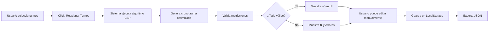

# InfectoPlan - Sistema de Gestión de Guardias Médicas

<div align="center">
  <h3>🏥 Automatización Inteligente de Asignación de Turnos</h3>
  <p>Sistema CSP (Constraint Satisfaction Problem) para el Departamento de Infectología</p>
</div>

---

## 📋 Descripción

**InfectoPlan** es una aplicación web profesional diseñada para automatizar y optimizar la asignación de guardias médicas en áreas de internación críticas. Utiliza un algoritmo avanzado de scoring ponderado que respeta restricciones duras (obligatorias) y blandas (preferencias), garantizando cobertura asistencial óptima mientras maximiza la satisfacción del personal.

### ✨ Características Principales

- **🧠 Motor de Asignación Inteligente**: Algoritmo CSP con sistema de puntuación para resolver restricciones complejas
- **📅 Calendario Interactivo**: Visualización clara de guardias con indicadores de estado en tiempo real
- **✏️ Edición Manual**: Override de asignaciones con validación automática de reglas
- **💾 Persistencia Local**: Almacenamiento en LocalStorage sin necesidad de servidor
- **📊 Validación Automática**: Detección de violaciones de restricciones con reportes detallados
- **📥 Exportación**: Descarga de cronogramas en formato JSON
- **🎨 UI Profesional**: Diseño moderno y responsivo con Tailwind CSS

---

## 🚀 Inicio Rápido

### Requisitos Previos

- **Node.js** 18+ y npm/yarn
- Navegador moderno (Chrome, Firefox, Safari, Edge)

### Instalación

```bash
# 1. Instalar dependencias
npm install

# 2. Iniciar servidor de desarrollo
npm run dev

# 3. Abrir en el navegador
# La aplicación se abrirá automáticamente en http://localhost:3000
```

### Compilación para Producción

```bash
# Generar build optimizado
npm run build

# Preview del build
npm run preview
```

---

## 📐 Arquitectura del Sistema

### Stack Tecnológico

| Capa | Tecnología | Propósito |
|------|-----------|-----------|
| **Frontend** | React 18 + TypeScript | Interfaz de usuario con tipado estricto |
| **Estilos** | Tailwind CSS | Diseño moderno y responsivo |
| **Build** | Vite | Desarrollo rápido y optimización de producción |
| **Fechas** | date-fns | Manejo preciso de calendarios |
| **Iconos** | Lucide React | Iconografía profesional |
| **Storage** | LocalStorage API | Persistencia sin backend |

### Estructura de Archivos

```
src/
├── types.ts                    # Definiciones TypeScript
├── constants.ts                # Datos maestros (médicos, áreas, reglas)
├── services/
│   ├── scheduler.ts            # Motor de asignación CSP
│   ├── storageService.ts       # Persistencia local
│   └── googleApiService.ts     # APIs de Google (preparado)
├── components/
│   ├── Sidebar.tsx             # Panel lateral con info del sistema
│   ├── CalendarGrid.tsx        # Grid de calendario mensual
│   ├── DayCard.tsx             # Tarjeta de día individual
│   └── AssignmentModal.tsx     # Modal de edición manual
├── App.tsx                     # Componente principal
├── main.tsx                    # Entry point
└── index.css                   # Estilos globales
```

---

## 🧩 Reglas de Negocio Implementadas

### Restricciones Duras (HARD) - Obligatorias

| ID | Regla | Implementación |
|----|-------|----------------|
| **R1.3** | Capacidad Diaria | Exactamente 3 profesionales por día |
| **R1.4** | Exclusión Mutua | Cristina y Agustina nunca juntas (sistema de alternancia) |

### Restricciones Blandas (SOFT) - Preferencias con Scoring

| ID | Regla | Peso | Efecto |
|----|-------|------|--------|
| **R3.1** | Cristina → Pueyrredón | +100 | Prioridad máxima para asignación |
| **R3.2** | Natalia/Leticia → Juncal | +100 | Prioridad máxima para asignación |
| **R3.3** | Agustina ⊗ Unidades Cerradas | -50 | Penalización (evitar excepto si no hay alternativa) |
| **R3.4** | Bonus Especialidad | +10 | Si especialidad coincide con área |

### Disponibilidad del Personal

| Médico | Días Disponibles | Especialidad |
|--------|------------------|--------------|
| **Leticia** | Mar, Jue, Vie | Infectología General |
| **Agustina** | Lun, Mar, Mié | Control de Infecciones |
| **Natalia** | Mar, Mié, Vie | Epidemiología |
| **Cristina** | Lun, Mar, Jue | Internación General (Concurrente) |
| **Cecilia** | Mié, Jue, Vie | Cuidados Críticos |

---

## 🎯 Uso de la Aplicación

### 1. Generar Cronograma

1. Seleccionar mes/año usando las flechas de navegación
2. Hacer clic en **"Reasignar Turnos"**
3. El sistema genera automáticamente las asignaciones óptimas
4. Revisar el indicador de validación (✅ o ❌)

### 2. Editar Manualmente

1. Hacer clic en cualquier tarjeta de día
2. Se abre el modal de edición
3. Cambiar asignaciones usando los dropdowns
4. El sistema muestra advertencias si se violan reglas
5. Guardar cambios (requiere confirmación si hay violaciones críticas)

### 3. Exportar Cronograma

1. Hacer clic en el botón **"Exportar"**
2. Se descarga un archivo JSON con el cronograma completo
3. Útil para backup o integración con otros sistemas

### 4. Interpretar Indicadores Visuales

- 🟢 **Verde**: Día con cobertura completa (3 profesionales)
- 🔴 **Rojo**: Día con cobertura incompleta (<3 profesionales)
- ✅ **Check verde**: Cronograma válido (todas las reglas cumplidas)
- ❌ **X roja**: Hay violaciones de restricciones

---

## 🔮 Integración con Google APIs (Futuro)

El sistema está preparado para integrar:

- **Gmail API**: Envío automático de notificaciones por email
- **Google Calendar API**: Creación de eventos en calendarios del personal

### Configuración (Cuando esté listo)

1. **Crear proyecto en Google Cloud Console**
   - Ir a [console.cloud.google.com](https://console.cloud.google.com)
   - Crear nuevo proyecto "InfectoPlan"

2. **Habilitar APIs**
   - Gmail API
   - Google Calendar API

3. **Crear credenciales OAuth 2.0**
   - Tipo: Aplicación Web
   - Orígenes autorizados: `http://localhost:3000`
   - URI de redirección: `http://localhost:3000`

4. **Configurar en el código**
   - Editar `src/services/googleApiService.ts`
   - Reemplazar `YOUR_CLIENT_ID` y `YOUR_API_KEY`
   - Descomentar las funciones de inicialización

---

## 🧪 Validación y Testing

El sistema incluye validación automática que verifica:

- ✅ Todos los días tienen 3 profesionales
- ✅ Cristina y Agustina nunca están juntas
- ✅ Los médicos están asignados solo en sus días disponibles
- ⚠️ Advertencias sobre asignaciones no óptimas (ej. Agustina en UC)

### Verificar Validación Manualmente

Abrir la consola del navegador (F12) después de generar un cronograma:

```
📊 REPORTE DE VALIDACIÓN:
Errores: []
Advertencias: ["2025-01-15: Agustina asignada a Unidades Cerradas (no preferido)"]
```

---

## 📊 Ejemplo de Flujo Completo



---

## 🛠️ Desarrollo y Personalización

### Añadir un Nuevo Médico

Editar `src/constants.ts`:

```typescript
export const DOCTORS: Doctor[] = [
  // ... médicos existentes
  {
    id: 'nuevo_medico',
    name: 'Nuevo Médico',
    availableDays: [1, 3, 5], // Lun, Mié, Vie
    specialty: 'Especialidad'
  }
];
```

### Modificar una Restricción

Editar `src/constants.ts` para cambiar pesos:

```typescript
{
  id: 'R3.1',
  weight: 150, // Aumentar prioridad de Cristina en Pueyrredón
  active: true
}
```

O desactivar:

```typescript
{
  id: 'R3.3',
  active: false // Agustina ya no evitará Unidades Cerradas
}
```

### Cambiar Colores del Tema

Editar `tailwind.config.js`:

```javascript
theme: {
  extend: {
    colors: {
      primary: { /* colores principales */ },
      accent: { /* colores de acento */ }
    }
  }
}
```

---

## 🐛 Solución de Problemas

### El cronograma no se guarda

- **Causa**: LocalStorage lleno o deshabilitado
- **Solución**: Limpiar datos del navegador o usar modo normal (no incógnito)

### Aparecen días incompletos

- **Causa**: No hay suficientes médicos disponibles ese día
- **Solución**: 
  1. Verificar disponibilidad en `constants.ts`
  2. Añadir más médicos
  3. Ajustar días laborables de médicos existentes

### Error al instalar dependencias

- **Causa**: Versión de Node.js incompatible
- **Solución**: Actualizar a Node.js 18+ (`node -v` para verificar)

---

## 📄 Licencia

Uso interno - Departamento de Infectología

---

## 👨‍💻 Soporte

Para consultas o mejoras, contactar al equipo de desarrollo o revisar los comentarios en el código fuente.

---

<div align="center">
  <p><strong>InfectoPlan</strong> - Optimización inteligente de recursos médicos</p>
  <p>Desarrollado con ❤️ para el Departamento de Infectología</p>
</div>

